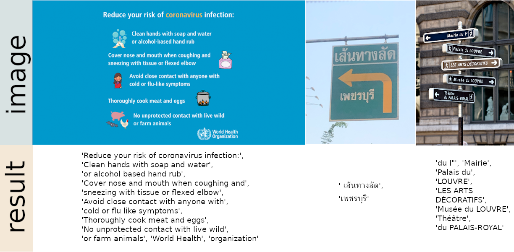
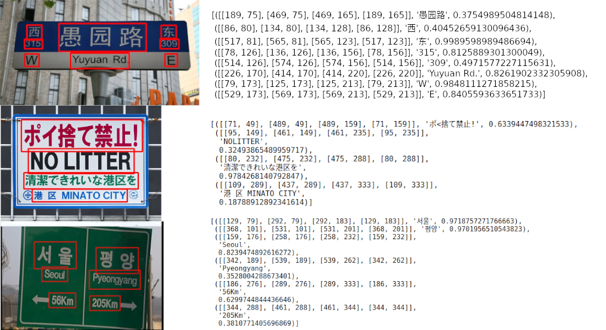

# EasyOCR

[](https://badge.fury.io/py/easyocr)
[](https://github.com/JaidedAI/EasyOCR/blob/master/LICENSE)
[](https://colab.fan/easyocr)
[](https://twitter.com/intent/tweet?text=Check%20out%20this%20awesome%20library:%20EasyOCR%20https://github.com/JaidedAI/EasyOCR)
[](https://twitter.com/JaidedAI)

Ready-to-use OCR with 70+ languages supported including Chinese, Japanese, Korean and Thai.

## What's new
- xx November 2020 - Version 1.1.11
    -
- 12 October 2020 - Version 1.1.10
    - Faster `beamsearch` decoder (thanks @amitbcp)
    - Better code structure (thanks @susmith98)
    - New language supports for Haryanvi(bgc), Sanskrit(sa) (Devanagari Script) and Manipuri(mni) (Bengari Script)
- 31 August 2020 - Version 1.1.9
    - Add `detect` and `recognize` method for performing text detection and recognition separately

- [Read all released notes](https://github.com/JaidedAI/EasyOCR/blob/master/releasenotes.md)

## What's coming next
- [New language support](https://github.com/JaidedAI/EasyOCR/issues/91)

## Examples






## Supported Languages

We are currently supporting 70+ languages. See [list of supported languages](https://www.jaided.ai/easyocr).

## Installation

Install using `pip` for stable release,

``` bash
pip install easyocr
```

For latest development release,

``` bash
pip install git+git://github.com/jaidedai/easyocr.git
```

Note 1: for Windows, please install torch and torchvision first by following the official instruction here https://pytorch.org. On pytorch website, be sure to select the right CUDA version you have. If you intend to run on CPU mode only, select CUDA = None.

Note 2: We also provide Dockerfile [here](https://github.com/JaidedAI/EasyOCR/blob/master/Dockerfile).

#### Try Third-Party Demos

1. [Google Colab](https://colab.fan/easyocr)
2. [Dockerhub](https://hub.docker.com/r/challisa/easyocr)
3. [Ainize](https://easyocrgpu-wook-2.endpoint.ainize.ai/)

## Usage

``` python
import easyocr
reader = easyocr.Reader(['ch_sim','en']) # need to run only once to load model into memory
result = reader.readtext('chinese.jpg')
```

Output will be in list format, each item represents bounding box, text and confident level, respectively.

``` bash
[([[189, 75], [469, 75], [469, 165], [189, 165]], '愚园路', 0.3754989504814148),
 ([[86, 80], [134, 80], [134, 128], [86, 128]], '西', 0.40452659130096436),
 ([[517, 81], [565, 81], [565, 123], [517, 123]], '东', 0.9989598989486694),
 ([[78, 126], [136, 126], [136, 156], [78, 156]], '315', 0.8125889301300049),
 ([[514, 126], [574, 126], [574, 156], [514, 156]], '309', 0.4971577227115631),
 ([[226, 170], [414, 170], [414, 220], [226, 220]], 'Yuyuan Rd.', 0.8261902332305908),
 ([[79, 173], [125, 173], [125, 213], [79, 213]], 'W', 0.9848111271858215),
 ([[529, 173], [569, 173], [569, 213], [529, 213]], 'E', 0.8405593633651733)]
```
Note 1: `['ch_sim','en']` is the list of languages you want to read. You can pass
several languages at once but not all languages can be used together.
English is compatible with every languages. Languages that share common characters are usually compatible with each other.

Note 2: Instead of filepath `chinese.jpg`, you can also pass OpenCV image object (numpy array) or image file as bytes. URL to raw image is also acceptable.

Note 3: The line `reader = easyocr.Reader(['ch_sim','en'])` is for loading model into memory. It takes some time but it need to be run only once.

You can also set `detail` = 0 for simpler output.

``` python
reader.readtext('chinese.jpg', detail = 0)
```
Result:
``` bash
['愚园路', '西', '东', '315', '309', 'Yuyuan Rd.', 'W', 'E']
```

Model weight for chosen language will be automatically downloaded or you can
download it manually from the following links and put it in '~/.EasyOCR/model' folder

- [text detection model (CRAFT)](https://drive.google.com/file/d/1tdItXPoFFeKBtkxb9HBYdBGo-SyMg1m0/view?usp=sharing)
- [latin model](https://drive.google.com/file/d/1M7Lj3OtUsaoppD4ZKudjepzCMsXKlxp3/view?usp=sharing)
- [chinese (traditional) model](https://drive.google.com/file/d/1xWyQC9NIZHNtgz57yofgj2N91rpwBrjh/view?usp=sharing)
- [chinese (simplified) model](https://drive.google.com/file/d/1-jN_R1M4tdlWunRnD5T_Yqb7Io5nNJoR/view?usp=sharing)
- [japanese model](https://drive.google.com/file/d/1ftAeVI6W8HvpLL1EwrQdvuLss23vYqPu/view?usp=sharing)
- [korean model](https://drive.google.com/file/d/1UBKX7dHybcwKK_i2fYx_CXaL1hrTzQ6y/view?usp=sharing)
- [thai model](https://drive.google.com/file/d/14BEuxcfmS0qWi3m9RsxwcUsjavM3rFMa/view?usp=sharing)
- [devanagari model](https://drive.google.com/file/d/1uCiMuBl8H8GAwapEjYUVYYdoOivyGzel/view?usp=sharing)
- [cyrillic model](https://drive.google.com/file/d/1SBmKXV5dpN5Cekacqk3ms1xq3dGbDuu1/view?usp=sharing)

In case you do not have GPU or your GPU has low memory, you can run it in CPU mode by adding gpu = False

``` python
reader = easyocr.Reader(['ch_sim','en'], gpu = False)
```

For more information, read [tutorial](https://www.jaided.ai/easyocr/tutorial) and [API Documentation](https://www.jaided.ai/easyocr/documentation).

#### Run on command line

```shell
$ easyocr -l ch_sim en -f chinese.jpg --detail=1 --gpu=True
```

## Implementation Roadmap

1. Language packs: Expand support to more languages. We are aiming to cover > 80-90% of world's population. Also improve existing languages.
2. Better documentation and api
3. Language model for better decoding
4. Handwritten support: The key is using GAN to generate realistic handwritten dataset.
5. Faster processing time: model pruning (lite version) / quantization / export to other platforms (ONNX?)
6. Open Dataset and model training pipeline
7. Restructure code to support swappable detection and recognition algorithm.
The api should be as easy as
``` python
reader = easyocr.Reader(['en'], detection='DB', recognition = 'CNN_Transformer')
```
The idea is to be able to plug-in any state-of-the-art model into EasyOCR. There are a lot of geniuses trying to make better detection/recognition model. We are not trying to be a genius here, just make genius's works quickly accessible to the public ... for free. (well I believe most geniuses want their work to create positive impact as fast/big as possible) The pipeline should be something like below diagram. Grey slots are placeholders for changeable light blue modules.


## Acknowledgement and References

This project is based on researches/codes from several papers/open-source repositories.

All deep learning part is based on [Pytorch](https://pytorch.org). :heart:

Detection part is using CRAFT algorithm from this [official repository](https://github.com/clovaai/CRAFT-pytorch) and their [paper](https://arxiv.org/abs/1904.01941) (Thanks @YoungminBaek from @clovaai). We also use their pretrained model.

Recognition model is CRNN ([paper](https://arxiv.org/abs/1507.05717)). It is composed of 3 main components, feature extraction (we are currently using [Resnet](https://arxiv.org/abs/1512.03385)), sequence labeling ([LSTM](https://www.bioinf.jku.at/publications/older/2604.pdf)) and decoding ([CTC](https://www.cs.toronto.edu/~graves/icml_2006.pdf)). Training pipeline for recognition part is a modified version from  [deep-text-recognition-benchmark](https://github.com/clovaai/deep-text-recognition-benchmark). (Thanks @ku21fan from @clovaai) This repository is a gem that deserved more recognition.

Beam search code is based on this [repository](https://github.com/githubharald/CTCDecoder) and his [blog](https://towardsdatascience.com/beam-search-decoding-in-ctc-trained-neural-networks-5a889a3d85a7). (Thanks @githubharald)

Data synthesis is based on [TextRecognitionDataGenerator](https://github.com/Belval/TextRecognitionDataGenerator). (Thanks @Belval)

And good read about CTC from distill.pub [here](https://distill.pub/2017/ctc/).

## Want To Contribute?

Let's advance humanity together by making AI available to everyone!

3 ways to contribute:

**Coder:** Please send PR for small bug/improvement. For bigger one, discuss with us by open an issue first. There is a list of possible bug/improvement issue tagged with ['PR WELCOME'](https://github.com/JaidedAI/EasyOCR/issues?q=is%3Aissue+is%3Aopen+label%3A%22PR+WELCOME%22).

**User:** Tell us how EasyOCR benefit you/your organization to encourage further development. Also post failure cases in [Issue  Section](https://github.com/JaidedAI/EasyOCR/issues) to help improving future model.

**Tech leader/Guru:** If you found this library useful, please spread the word! (See [Yann Lecun's post](https://www.facebook.com/yann.lecun/posts/10157018122787143) about EasyOCR)

## Guideline for new language request

To request a new language support, I need you to send a PR with 2 following files

1. In folder [easyocr/character](https://github.com/JaidedAI/EasyOCR/tree/master/easyocr/character),
we need 'yourlanguagecode_char.txt' that contains list of all characters. Please see format example from other files in that folder.
2. In folder [easyocr/dict](https://github.com/JaidedAI/EasyOCR/tree/master/easyocr/dict),
we need 'yourlanguagecode.txt' that contains list of words in your language.
On average we have ~30000 words per language with more than 50000 words for popular one.
More is better in this file.

If your language has unique elements (such as 1. Arabic: characters change form when attach to each other + write from right to left 2. Thai: Some characters need to be above the line and some below), please educate me with your best ability and/or give useful links. It is important to take care of the detail to achieve a system that really works.

Lastly, please understand that my priority will have to go to popular language or set of languages that share most of characters together (also tell me if your language share a lot of characters with other). It takes me at least a week to work for new model. You may have to wait a while for new model to be released.

See [List of languages in development](https://github.com/JaidedAI/EasyOCR/issues/91)

## Business Inquiries

For Enterprise Support, [Jaided AI](https://www.jaided.ai/) offers full service for custom OCR/AI systems from building, maintenance and deployment. Click [here](https://www.jaided.ai/contact) to contact us.
